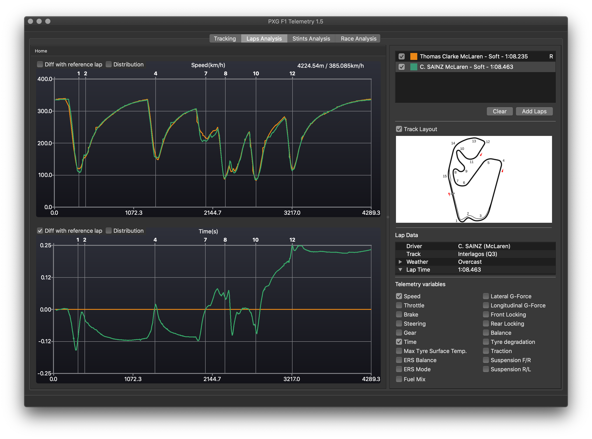

PXG F1 Telemetry is a tool to record, review and analyse UDP telemetry data from Codemasters F1 2019.

## Features

F1 Telemetry is able to analyse laps and stints (multiple consecutive laps) of every drivers in the session (human or a.i.).

It allows you to :

- Compare your lap with the A.I. or other drivers to improve your driving
- Refine your setups
- Prepare your own practice programmes 

Data of the selected drivers is recorded on the hard drive during the session and can be reviewed later. There is no real time display !

### Analysis available for laps

- Speed
- Throttle input
- Brake input
- Steering input
- Gear
- Time differences
- Tyre wear
- Tyre temperatures
- Tyre degradation
- Suspension
- ERS balance
- Tyres lockup
- Car balance i.e. oversteer / understeer
- Multiple laps comparison

### Analysis available for stints

- Lap times
- Average tyre wear per lap
- Max tyre temperature
- Fuel consumption
- ERS energy
- Multiple stints comparison

## Compilation

- Download and install Qt 5.14.1 or higher from www.qt.io
- Open "F1Telemetry.pro" with Qt creator and compile the project

## Deployment

### macOS
- Add a custom build step in Qt Creator:
 - Command: $QTDIR/bin/macdeployqt
 - Arguments: src/PXG\ F1\ Telemetry.app 
  
### Windows
- Add a custom build step in Qt Creator:
 - Command: %QTDIR%/bin/windeployqt.exe
 - Arguments: "src\release\PXG F1 Telemetry.exe" --dir package
- Copy "PXG F1 Telemetry.exe" in the package directory

## Author
Thibaud Rabillard (trabillard@laposte.net)
